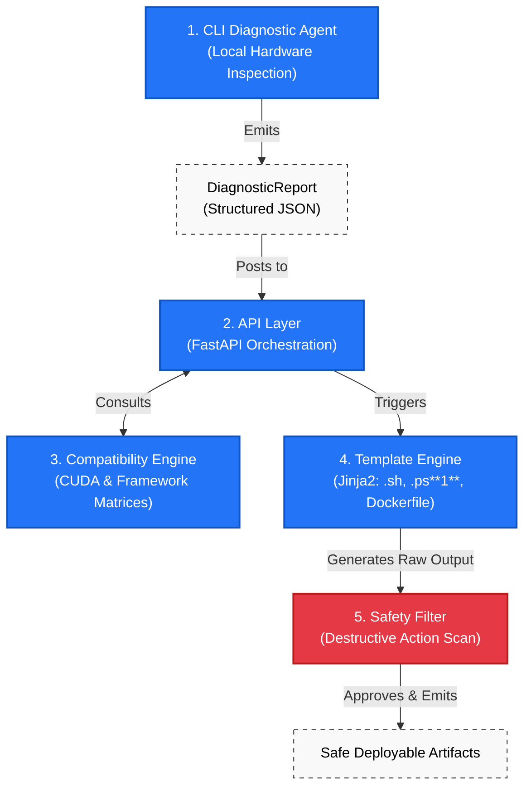

<div align="center">
  
# EnvForge 🛠️

### ✨ Production-Grade ML Environment Provisioning Platform

EnvForge is an **intelligent environment provisioning platform** that **automates one of the most frustrating parts of machine learning development: creating reliable and compatible development environments.**

By combining **hardware diagnostics, compatibility-aware version resolution, template-driven script generation, and built-in safety validation**, EnvForge enables developers to **generate deterministic setup scripts for PyTorch, TensorFlow, CUDA, YOLO, and other ML ecosystems across Windows, WSL, and Linux.**

**No more** CUDA mismatches. No more dependency conflicts. No more hours spent debugging installation issues.

<i>**Generate. Verify. Deploy. Build AI with confidence.**</i>

</div>

----

## Contributors

👥 A massive thank you to all the developers who have contributed code, resolved issues, and helped shape EnvForge into a production-grade ML environment provisioning platform!

<a href="https://github.com/rishabh0510rishabh/EnvForage/graphs/contributors">
  
</a>

*Made with [contrib.rocks](https://contrib.rocks).*

----

## 📑 Table of Contents
- [🎯 Project Overview](#project-overview)
- [👥 Contributors](#contributors)
- [✅ Features](#features)
- [🏗️ Architecture](#architecture)
- [📂 Project Structure](#project-structure)
- [🚀 Steps To Run](#steps-to-run)
- [📚 Documentation Links](#documentation-links)
- [🤝 Contributing](#contributing)
- [🗺️ Roadmap](#roadmap)
- [⚖️ License](#license)

----

## Project Overview

**Deterministic logic > AI generation.**
Because scripts affect real systems, EnvForge relies on a strictly deterministic **Compatibility Engine** to resolve versions. It never guesses package versions or writes destructive shell commands.

EnvForge helps users:
* 🔧 Generate environment setup scripts (`setup.sh`, `setup.ps1`, `Dockerfile`)
* 🧪 Install compatible ML frameworks (TensorFlow, PyTorch, YOLO, etc.)
* ✅ Verify existing environments
* 🩺 Diagnose setup issues across OS, GPU, and Python boundaries

----

## Features

- **Environment Profiles**: Out-of-the-box configurations for `pytorch-cuda`, `tf-gpu`, `yolov8`, and more.
- **Hardware Introspection**: A standalone CLI agent (`envforge-agent`) that detects OS, RAM, GPU, VRAM, and CUDA details without an internet connection.
- **Safety First**: Every generated script passes through a regex-based `SafetyFilter` that strictly blocks dangerous commands (e.g., `rm -rf /`, `mkfs`).
- **Idempotent Setup**: Scripts verify prerequisites before installing anything.
- **RESTful API**: Fast, async backend built on FastAPI and PostgreSQL.

----

## Architecture

🏗️ EnvForge is built with a modular, scalable architecture.

1. **CLI Diagnostic Agent**: Inspects local hardware and emits a structured JSON `DiagnosticReport`.
2. **API Layer**: FastAPI handles incoming requests and orchestrates logic.
3. **Compatibility Engine**: A pure-Python module holding the "Engineering Moat" — the CUDA and Framework compatibility matrices.
4. **Template Engine**: Renders Jinja2 templates (`.sh`, `.ps1`, `Dockerfile`) based on the resolved environment.
5. **Safety Filter**: Scans rendered output to block destructive actions.



For more details, see [ARCHITECTURE.md](./docs/ARCHITECTURE.md).

----

## Project Structure

```text
EnvForage/
├── .github/                  # GitHub templates, workflows, and automation
│   ├── ISSUE_TEMPLATE/
│   ├── workflows/
│   ├── CODEOWNERS
│   ├── dependabot.yml
│   └── PULL_REQUEST_TEMPLATE.md
│
├── backend/                  # FastAPI backend and compatibility engine
│   ├── alembic/              # Database migrations
│   ├── app/
│   │   ├── ai/               # AI troubleshooting logic
│   │   ├── api/              # API routes
│   │   ├── compatibility/    # CUDA/Framework compatibility engine
│   │   ├── core/             # Core application logic
│   │   ├── middleware/       # Custom middleware
│   │   ├── models/           # Database models
│   │   ├── schemas/          # Pydantic schemas
│   │   ├── services/         # Business services
│   │   └── templates/        # Script generation templates
│   │
│   ├── scripts/              # Utility scripts
│   ├── seeds/                # Compatibility matrices and profiles
│   ├── tests/                # Unit, integration, and API tests
│   ├── Dockerfile
│   └── pyproject.toml
│
├── frontend/                 # Next.js web application
│   ├── public/
│   ├── src/
│   │   ├── app/
│   │   │   ├── diagnose/     # Environment diagnostics UI
│   │   │   ├── generate/     # Script generation UI
│   │   │   ├── profiles/     # Environment profiles
│   │   │   └── troubleshoot/ # AI troubleshooting interface
│   │   │
│   │   ├── components/       # Reusable React components
│   │   ├── services/         # API communication layer
│   │   └── types/            # TypeScript types
│   │
│   ├── Dockerfile
│   └── package.json
│
├── cli/                      # Standalone diagnostic CLI agent
├── docs/                     # Project documentation
│
├── docker-compose.yml        # Development environment
├── docker-compose.prod.yml   # Production deployment
├── CONTRIBUTING.md           # Contribution guidelines
├── CODE_OF_CONDUCT.md        # Community standards
├── SECURITY.md               # Security policy
├── TROUBLESHOOTING.md        # Common issues & fixes
├── CHANGELOG.md              # Release history
├── LICENSE
└── README.md
```

----

## Steps To Run

### 1. Install the CLI Agent
Inspect your environment without needing the backend!
```bash
pip install envforge-agent
envforge diagnose
```


### 2. Run the Backend (Docker)
```bash
git clone https://github.com/rishabh0510rishabh/EnvForage.git
cd EnvForage
docker-compose up -d
```

### 3. Run the Backend (Kubernetes)
**Prerequisites:**
- [Helm 3+](https://helm.sh/docs/intro/install/)
- A running Kubernetes cluster (Docker Desktop, minikube, or cloud)
- NGINX Ingress Controller (only if `ingress.enabled=true`):
```bash
  kubectl apply -f https://raw.githubusercontent.com/kubernetes/ingress-nginx/controller-v1.10.0/deploy/static/provider/cloud/deploy.yaml
```

```bash
helm install envforge ./helm/envforge

# Enable ingress (optional)
helm install envforge ./helm/envforge \
  --set ingress.enabled=true \
  --set ingress.host=api.yourdomain.com

kubectl port-forward svc/envforge 8000:8000
kubectl port-forward svc/envforge-frontend 3000:3000
```

🚀 The API is now running at `http://localhost:8000`.

### 3. Generate a Script
Generate a PyTorch CUDA setup script for Linux:
```bash
curl -X POST http://localhost:8000/api/v1/scripts/generate \
  -H "Content-Type: application/json" \
  -d '{"profile_id": "pytorch-cuda", "target_os": "LINUX", "output_formats": ["setup.sh"]}'
```

----

## Documentation Links

| 📚 Document | Purpose |
|----------|---------|
| [ARCHITECTURE.md](./docs/ARCHITECTURE.md) | High-level system overview and component boundaries |
| [COMPATIBILITY_ENGINE.md](./docs/COMPATIBILITY_ENGINE.md) | Core logic: CUDA mappings and framework rules |
| [WORKFLOW.md](./docs/WORKFLOW.md) | Script generation, diagnosis, and repair flows |
| [AI_USAGE_POLICY.md](./docs/AI_USAGE_POLICY.md) | Where AI is allowed vs where deterministic logic is required |
| [SCRIPT_SAFETY.md](./docs/SCRIPT_SAFETY.md) | Prohibited commands and rollback philosophy |
| [CLI_REFERENCE.md](./docs/CLI_REFERENCE.md) | Commands for `envforge diagnose`, `verify`, and `fix` |
| [API_DESIGN.md](./docs/API_DESIGN.md) | REST endpoints, schemas, and validation rules |
| [PROFILE_SPEC.md](./docs/PROFILE_SPEC.md) | How to build and define new ML profiles |
| [TASKS.md](./TASKS.md) | The master implementation blueprint |

----

## Contributing

🤝 We love open source! Contributions of all sizes are welcome — whether it's fixing bugs, improving documentation, adding new environment profiles, enhancing the compatibility engine, or proposing new features.

Please read our [Contributing Guide](./CONTRIBUTING.md) before getting started. You'll find detailed instructions for:

* Local development setup (Docker & non-Docker workflows)
* Backend, frontend, and CLI development
* Branching and commit message conventions
* Adding new profiles and script templates
* Testing requirements and quality standards
* Pull request guidelines and code review expectations

Before submitting a contribution, please ensure that all tests pass and relevant documentation is updated.

Thank you for helping make EnvForge more reliable, safe, and developer-friendly!

----

## Roadmap

- **Phase 1**: Core Backend (Compatibility Engine, Template Engine) ✅
- **Phase 2**: CLI Diagnostic Agent (`envforge-agent`) ✅
- **Phase 3**: Next.js Frontend Web App ✅
- **Phase 4**: AI Troubleshooting Layer ✅
- **Phase 5**: Environment Verification ✅
- **Phase 6**: Polish & Production Readiness ✅

🗺️ See the full [ROADMAP.md](./docs/ROADMAP.md) for details.

----

## License

This project is licensed under the MIT License - see the [LICENSE](./LICENSE) file for details.
