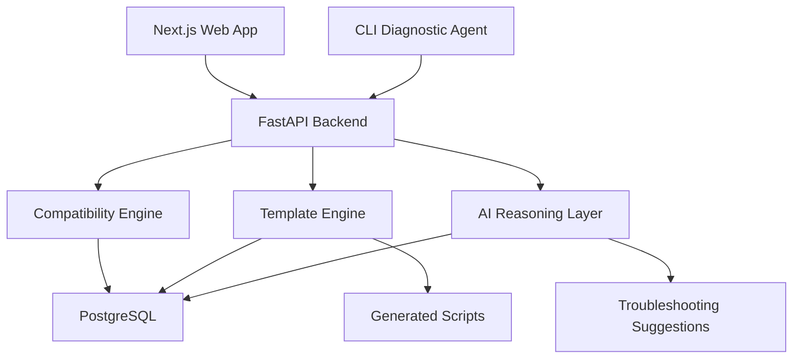
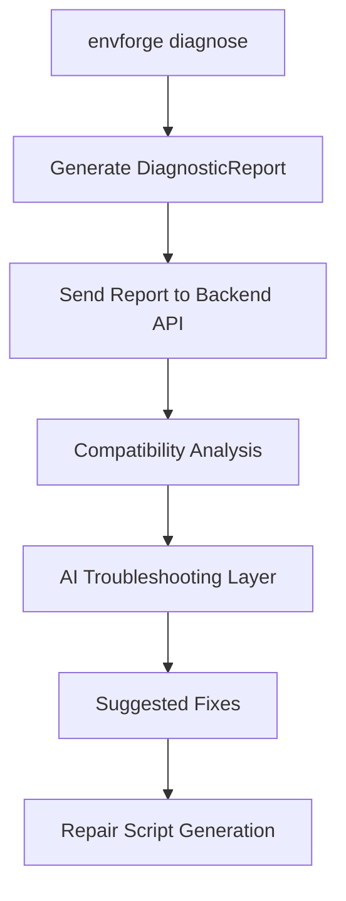

# EnvForge — System Architecture

> **Version**: 1.0.0
> **Status**: Phase 1 & 3 Implemented
> **Last Updated**: 2026-05-14

> **Implementation Coverage**: Backend API, Compatibility Engine, Template Engine, Database layer, and Frontend Web App (Phase 3) are fully implemented. CLI Agent (Phase 2) pending.

---

## 1. Overview

EnvForge is a production-grade ML/AI environment provisioning platform. It provides:
- Intelligent setup script generation for Windows, WSL, Linux, and CUDA environments
- Compatibility-aware ML framework installation guidance
- Local diagnostic agents for environment introspection
- AI-assisted troubleshooting and repair script generation

---

## 2. High-Level Architecture

```
┌────────────────────────────────────────────────────────────────────┐
│                        CLIENT LAYER                                │
│                                                                    │
│   ┌─────────────────────────┐    ┌──────────────────────────────┐  │
│   │   Next.js Web App       │    │  CLI Diagnostic Agent        │  │
│   │   (TypeScript, Tailwind)│    │  (Python, standalone)        │  │
│   └──────────┬──────────────┘    └──────────────┬───────────────┘  │
└──────────────┼───────────────────────────────────┼─────────────────┘
               │ HTTPS / REST                       │ stdout / JSON
               ▼                                    ▼
┌────────────────────────────────────────────────────────────────────┐
│                        API GATEWAY LAYER                           │
│                  FastAPI (Python 3.11+)                            │
│                                                                    │
│   ┌──────────────┐ ┌────────────────┐ ┌────────────────────────┐  │
│   │ /profiles    │ │ /scripts       │ │ /diagnose              │  │
│   │ /verify      │ │ /troubleshoot  │ │ /repair                │  │
│   └──────────────┘ └────────────────┘ └────────────────────────┘  │
└────────────────────────────────┬───────────────────────────────────┘
                                 │
          ┌──────────────────────┼──────────────────────┐
          ▼                      ▼                       ▼
┌──────────────────┐  ┌────────────────────┐  ┌──────────────────────┐
│ Compatibility    │  │ Template Engine    │  │ AI Reasoning Layer   │
│ Engine           │  │ (Jinja2)           │  │ (LLM API Gateway)    │
│                  │  │                    │  │                      │
│ - Version logic  │  │ - setup.sh         │  │ - Issue explanation  │
│ - CUDA mappings  │  │ - setup.ps1        │  │ - Fix suggestions    │
│ - Python compat  │  │ - requirements.txt │  │ - Repair scripts     │
│ - OS detection   │  │ - Dockerfile       │  │ - Safe command gen   │
└────────┬─────────┘  │ - devcontainer     │  └──────────────────────┘
         │            └────────────────────┘
         ▼
┌──────────────────────────────────────────────────────────────────┐
│                         DATA LAYER                               │
│                                                                  │
│   ┌─────────────────────────────────────────────────────────┐   │
│   │             PostgreSQL                                  │   │
│   │  profiles | compat_matrix | scripts | diag_reports      │   │
│   │  user_sessions | framework_versions | cuda_mappings     │   │
│   └─────────────────────────────────────────────────────────┘   │
└──────────────────────────────────────────────────────────────────┘
```

### Mermaid Architecture Diagram


---

## 3. Layer Responsibilities

### 3.1 Frontend (Next.js)
- Profile browser and selector UI
- Script generation wizard (multi-step form)
- Diagnostic report rendering
- Download manager for generated artifacts
- AI chat interface for troubleshooting
- No business logic; purely a presentation + API consumption layer

### 3.2 Backend (FastAPI)
- All business logic lives here
- RESTful API with OpenAPI docs auto-generated
- Orchestrates: Compatibility Engine → Template Engine → AI Layer
- Manages sessions, caching, and rate limiting
- Input validation with Pydantic v2 models

### 3.3 Compatibility Engine
- Pure Python module — no side effects, fully deterministic
- Resolves compatible version combinations given constraints
- Maintains CUDA↔Driver↔Framework matrix
- Raises explicit `IncompatibilityError` with human-readable explanations

**Phase 1 Implementation**: `backend/app/compatibility/`
- `resolver.py` — `CompatibilityResolver` class (pure, no I/O)
- `errors.py` — `IncompatibilityError`, `UnknownVersionError`, `UnsupportedOSError`
- `matrix/cuda.py` — CUDA 11.8, 12.1, 12.4 with driver/cuDNN data
- `matrix/python.py` — torch 2.0–2.4, tensorflow 2.13–2.15, ultralytics 8.x
- `matrix/os_rules.py` — OS-specific constraint rules (WSL GPU note, TF Windows note)

### 3.4 Template Engine (Jinja2)
- Renders scripts from validated `EnvironmentProfile` objects
- All templates are version-pinned; no floating `latest`
- Templates are contributor-friendly plain-text Jinja2 files

**Phase 1 Implementation**: `backend/app/templates/`
- `engine.py` — `TemplateRenderer` (maps output filename → Jinja2 template)
- `safety.py` — `SafetyFilter` with 15 forbidden shell patterns
- `models.py` — `TemplateContext`, `RenderResult`
- `jinja/setup/` — `setup_linux.sh.j2`, `setup_windows.ps1.j2`
- `jinja/config/` — `requirements.j2`, `dockerfile.j2`, `devcontainer.j2`
- `jinja/verify/` — `verify_torch.sh.j2`

### 3.5 AI Reasoning Layer
- Receives structured diagnostic context, NOT raw shell output
- Returns structured `SuggestedFix` objects, NOT raw shell commands
- All AI-generated shell commands are sanitized before exposure
- LLM provider is pluggable (OpenAI, OpenRouter, local Ollama)

**Phase 1 Implementation** (skeleton): `backend/app/ai/`
- `models.py` — `SuggestedFix`, `TroubleshootResponse` (Pydantic)
- `providers/base.py` — `LLMProvider` ABC
- `providers/mock.py` — `MockProvider` for testing
- Full integration: Phase 4

### 3.6 CLI Diagnostic Agent
- Standalone Python package (`pip install envforge-agent`)
- Collects system info: OS, GPU, VRAM, CUDA, Python, drivers
- Outputs structured JSON — can pipe to API or view locally
- No network requirement; works fully offline

### Diagnose → Troubleshoot → Repair Workflow



**Phase 1 Implementation**: Backend `POST /api/v1/diagnose` endpoint implemented and
accepts `DiagnosticReportSchema` JSON. The CLI agent package itself is Phase 2.

### 3.7 Data Layer (PostgreSQL)
- Stores environment profiles and compatibility matrices
- Stores generated script history and diagnostic reports
- User sessions (if auth is added in later phase)

**Phase 1 Implementation**:
- Alembic migration `0001_initial.py` creates all 10 tables
- Async SQLAlchemy 2.0 ORM models for all entities
- Idempotent seed service loads profiles from `seeds/profiles.yaml` on startup
- `selectinload` used for all relationship eager loading (prevents N+1 queries)

**Important Note on Managed PostgreSQL (Supabase)**:
Because Supabase has transitioned its default database endpoints (`db.[ref].supabase.co`) to be IPv6-only, local development on IPv4 networks will face `ConnectionRefusedError` (e.g., `WinError 1225`). To connect locally, you must use the **Supavisor Connection Pooler** in **Session Mode** (port 5432) for Alembic migrations and the backend, which provides an IPv4 address (`aws-0-[region].pooler.supabase.com`).

---

## 4. Backend/Frontend Boundary

| Concern                        | Frontend | Backend |
|-------------------------------|----------|---------|
| Profile listing / filtering    | Renders  | Serves  |
| Version compatibility logic    | ✗        | ✓       |
| Script generation              | Download | Generates |
| Diagnostic parsing             | Renders  | Parses  |
| AI prompt construction         | ✗        | ✓       |
| LLM API calls                  | ✗        | ✓       |
| Template rendering             | ✗        | ✓       |
| Input validation               | Basic UX | Authoritative |

**Rule**: Frontend never calls LLM APIs directly. Backend owns all AI interactions.

---

## 5. Deployment Architecture (Production Target)

```
Internet → Vercel Edge Network
              └── /*      → Next.js Web App (Serverless/Edge)

Internet → Render (Web Service)
              └── /api/*  → FastAPI (uvicorn, containerized)

FastAPI → PostgreSQL (Supabase IPv4 Pooler)
FastAPI → Redis (session cache, rate limiting — Phase 2)
FastAPI → OpenRouter / LLM Provider (Phase 4)
```

---

## 6. Key Design Decisions

| Decision | Choice | Rationale | ADR |
|----------|--------|-----------|-----|
| API style | REST (not GraphQL) | Simpler contributor onboarding, OpenAPI docs | [ADR-001](./decisions/ADR-001-rest-over-graphql.md) |
| ORM | SQLAlchemy 2.0 async | Type-safe, async-native, production-standard | — |
| Validation | Pydantic v2 | FastAPI native, fast, strongly-typed | — |
| Template engine | Jinja2 | Battle-tested, readable for contributors | [ADR-003](./decisions/ADR-003-jinja2-template-engine.md) |
| AI safety | Structured output only | Prevents prompt injection → shell execution | [ADR-002](./decisions/ADR-002-structured-ai-output.md) |
| CLI packaging | standalone pip package | No web dependency; works in air-gapped envs | — |
| Relationship loading | `selectinload` (eager) | Prevents N+1 queries on profile+packages | [ADR-004](./decisions/ADR-004-selectinload-eager-loading.md) |
| Seed data | YAML fixtures + idempotent service | Reproducible, reviewable, version-controlled | [ADR-005](./decisions/ADR-005-yaml-seed-service.md) |
| Unit test DB | SQLite in-memory | Fast, no external deps for unit tests | [ADR-006](./decisions/ADR-006-sqlite-unit-tests.md) |

---

## 7. Related Documents

- [`FEATURES.md`](./FEATURES.md) — Feature specifications with implementation status
- [`ROADMAP.md`](./ROADMAP.md) — Development phases
- [`API_DESIGN.md`](./API_DESIGN.md) — Endpoint specifications
- [`DATABASE_SCHEMA.md`](./DATABASE_SCHEMA.md) — PostgreSQL schema
- [`COMPATIBILITY_ENGINE.md`](./COMPATIBILITY_ENGINE.md) — Version logic
- [`TEMPLATE_SYSTEM.md`](./TEMPLATE_SYSTEM.md) — Script generation
- [`AI_LAYER.md`](./AI_LAYER.md) — AI integration design
- [`PROJECT_STRUCTURE.md`](./PROJECT_STRUCTURE.md) — Folder layout and rules
- [`decisions/`](./decisions/) — Architecture Decision Records (ADRs)

### ADR Index

| ADR | Decision | Status |
|-----|----------|--------|
| [ADR-001](./decisions/ADR-001-rest-over-graphql.md) | REST over GraphQL | Accepted |
| [ADR-002](./decisions/ADR-002-structured-ai-output.md) | Structured AI output | Accepted |
| [ADR-003](./decisions/ADR-003-jinja2-template-engine.md) | Jinja2 for templates | Accepted |
| [ADR-004](./decisions/ADR-004-selectinload-eager-loading.md) | SQLAlchemy selectinload | Accepted |
| [ADR-005](./decisions/ADR-005-yaml-seed-service.md) | YAML seed service | Accepted |
| [ADR-006](./decisions/ADR-006-sqlite-unit-tests.md) | SQLite for unit tests | Accepted |
| [ADR-007](./decisions/ADR-007-dynamic-ui-compatibility-fields.md) | Dynamic UI for Script Wizard | Accepted |
| [ADR-008](./decisions/ADR-008-safety-filter-negative-lookahead.md) | Safety Filter negative lookahead | Accepted |
| [ADR-009](./decisions/ADR-009-openrouter-primary-gateway.md) | OpenRouter as primary LLM gateway | Accepted |
